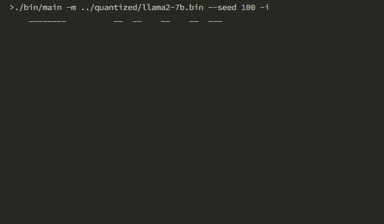

# ChatLLM.cpp

[](LICENSE)



Inference of a bunch of models from less than 3B to more than 45B, for real-time chatting on your computer (CPU),
pure C++ implementation based on [@ggerganov](https://github.com/ggerganov)'s [ggml](https://github.com/ggerganov/ggml):

* LlaMA-like (`LlamaForCausalLM`):
    * [x] All LlaMA-1 models
    * [x] LlaMA-2: [Chat-7B](https://huggingface.co/meta-llama/Llama-2-7b-chat-hf), etc
    * [x] CodeLlaMA: [Instruct-7B](https://huggingface.co/codellama/CodeLlama-7b-Instruct-hf)
    * [x] DeepSeek: [Chat-7B](https://huggingface.co/deepseek-ai/deepseek-llm-7b-chat), [Coder-6.7B](https://huggingface.co/deepseek-ai/deepseek-coder-6.7b-instruct) 🔥
    * [x] Yi: [Chat-6B](https://huggingface.co/01-ai/Yi-6B-Chat), [Chat-34B](https://huggingface.co/01-ai/Yi-34B-Chat)
    * [x] WizardLM: [LM 7B](https://huggingface.co/WizardLM/WizardLM-7B-V1.0), [LM 13B](https://huggingface.co/WizardLM/WizardLM-13B-V1.2), [Coder Python-7B](https://huggingface.co/WizardLM/WizardCoder-Python-7B-V1.0)
    * [x] TigerBot: [Chat-7B](https://huggingface.co/TigerResearch/tigerbot-7b-chat), [Chat-13B](https://huggingface.co/TigerResearch/tigerbot-13b-chat-v5)

* Baichuan (`BaichuanForCausalLM`)
    * [x] [Chat-7B](https://huggingface.co/baichuan-inc/Baichuan2-7B-Chat), [Chat-13B](https://huggingface.co/baichuan-inc/Baichuan2-13B-Chat)

* ChatGLM (`ChatGLMModel`):
    * [x] ChatGLM: [6B](https://huggingface.co/THUDM/chatglm-6b)
    * [x] ChatGLM2 family: [ChatGLM2 6B](https://huggingface.co/THUDM/chatglm2-6b), [CodeGeeX2 6B](https://huggingface.co/THUDM/codegeex2-6b), [ChatGLM3 6B](https://huggingface.co/THUDM/chatglm3-6b)

        Tip on CodeGeeX2: Code completion only, no context. Use system prompt to specify language, e.g. `-s "# language: python"`.

* InternLM (`InternLMForCausalLM`)
    * [x] [Chat-7B](https://huggingface.co/internlm/internlm-chat-7b), [Chat-7B v1.1](https://huggingface.co/internlm/internlm-chat-7b-v1_1)
    * [x] [Chat-20B](https://huggingface.co/internlm/internlm-chat-20b)

* Mistral (`MistralForCausalLM`, `MixtralForCausalLM`)
    * [x] Mistral: [Instruct-7B](https://huggingface.co/mistralai/Mistral-7B-Instruct-v0.2), [7B](https://huggingface.co/mistralai/Mistral-7B-v0.1)

    * [x] OpenChat: [3.5](https://huggingface.co/openchat/openchat-3.5-1210/) 🔥

        Tip: Use system prompt to select modes: `-s GPT4` (default mode), `-s Math` (mathematical reasoning mode).

    * [x] WizardLM: [Math 7B](https://huggingface.co/WizardLM/WizardMath-7B-V1.1)

    * [x] Mixtral: [Instruct-8x7B](https://huggingface.co/mistralai/Mixtral-8x7B-Instruct-v0.1) 🔥

        Two implementations of sliding-window attention (see `SlidingWindowAttentionImpl`):

        - Full cache: more RAM is needed (**default**).
        - Ring cache (i.e. rolling cache): less RAM, but current implementation is *naive* (slow). 💣

    * [x] NeuralBeagle14: [7B](https://huggingface.co/mlabonne/NeuralBeagle14-7B)

* Phi (`PhiForCausalLM`)
    * [x] [Phi-2](https://huggingface.co/microsoft/phi-2/tree/eb8bbd1d37d258ea74fb082c53346d33056a83d4) 🔥

        Tip: `--temp 0` is recommended. Don't forget to try `--format qa`.

    * [x] [Dolphin Phi-2](https://huggingface.co/cognitivecomputations/dolphin-2_6-phi-2/tree/a084bb141f99f67e8ff56a654e29ddd53a0b4d7a) 🐬

* QWenLM (`QWenLMHeadModel`)
    * [x] [Chat-7B](https://huggingface.co/Qwen/Qwen-7B-Chat), [Chat-14B](https://huggingface.co/Qwen/Qwen-14B-Chat)

* BlueLM (`BlueLMForCausalLM`)
    * [x] [Chat-7B](https://huggingface.co/vivo-ai/BlueLM-7B-Chat), [Chat-7B 32K](https://huggingface.co/vivo-ai/BlueLM-7B-Chat-32K)

* Stable-LM (`StableLMEpochModel`)
    * [x] [Code-3B](https://huggingface.co/stabilityai/stable-code-3b)

        Note: This model is an autocompletion model, not a chat/instruction model, so please use `--format completion`.

## Features

* [x] Accelerated memory-efficient CPU inference with int4/int8 quantization, optimized KV cache and parallel computing;
* [x] Use OOP to address the similarities between different _Transformer_ based models;
* [x] Streaming generation with typewriter effect;
* [x] Continuous chatting (content length is virtually unlimited)

    Two methods are available: _Restart_ and _Shift_. See `--extending` options.

* [ ] LoRA;
* [ ] Python binding, web demo, and more possibilities.

**Preparation**

Clone the ChatLLM.cpp repository into your local machine:

```sh
git clone --recursive https://github.com/foldl/chatllm.cpp.git && cd chatllm.cpp
```

If you forgot the `--recursive` flag when cloning the repository, run the following command in the `chatllm.cpp` folder:

```sh
git submodule update --init --recursive
```

**Quantize Model**

Use `convert.py` to transform models into quantized GGML format. For example, to convert the _fp16_ base model to q8_0 (quantized int8) GGML model, run:

```sh
# DeepSeek LLM Chat models
python3 convert.py -i path/to/model -t q8_0 -o quantized.bin -a DeepSeek

# DeepSeek Coder models
python3 convert.py -i path/to/model -t q8_0 -o quantized.bin -a DeepSeekCoder

# CodeLlaMA models
python3 convert.py -i path/to/model -t q8_0 -o quantized.bin -a CodeLlaMA

# Yi models
python3 convert.py -i path/to/model -t q8_0 -o quantized.bin -a Yi

# WizardCoder models
python3 convert.py -i path/to/model -t q8_0 -o quantized.bin -a WizardCoder

# WizardLM models
python3 convert.py -i path/to/model -t q8_0 -o quantized.bin -a WizardLM

# WizardMath models
python3 convert.py -i path/to/model -t q8_0 -o quantized.bin -a WizardMath

# OpenChat models
python3 convert.py -i path/to/model -t q8_0 -o quantized.bin -a OpenChat

# TigerBot models
python3 convert.py -i path/to/model -t q8_0 -o quantized.bin -a TigerBot

# Dolphin (based on Phi-2) models
python3 convert.py -i path/to/model -t q8_0 -o quantized.bin -a DolphinPhi2

# For other models, such as ChatLLM-6B, ChatLLM2-6B, InternLM, LlaMA, LlaMA-2, Baichuan-2, etc
python3 convert.py -i path/to/model -t q8_0 -o quantized.bin
```

Note: Only HF format is supported; Format of the generated `.bin` files is different from the one (GGUF) used by `llama.cpp`.

**Build & Run**

Compile the project using CMake:

```sh
cmake -B build
# On Linux, WSL:
cmake --build build -j
# On Windows with MSVC:
cmake --build build -j --config Release
```

Now you may chat with a quantized model by running:

```sh
./build/bin/main -m chatglm-ggml.bin                            # ChatLLM-6B
# 你好👋！我是人工智能助手 ChatGLM-6B，很高兴见到你，欢迎问我任何问题。
./build/bin/main -m chatglm2-ggml.bin --top_p 0.8 --temp 0.8    # ChatLLM2-6B
# 你好👋！我是人工智能助手 ChatGLM2-6B，很高兴见到你，欢迎问我任何问题。
./build/bin/main -m llama2.bin  --seed 100                      # Llama-2-Chat-7B
# Hello! I'm here to help you with any questions or concerns ....
```

To run the model in interactive mode, add the `-i` flag. For example:

```
# On Windows
.\build\bin\Release\main -m model.bin -i

# On Linux (or WSL)
rlwrap ./build/bin/main -m model.bin -i
```

In interactive mode, your chat history will serve as the context for the next-round conversation.

Run `./build/bin/main -h` to explore more options!

## Acknowledgements

* This project is started as refactoring of [ChatGLM.cpp](https://github.com/li-plus/chatglm.cpp), without which, this project could not be possible.

* Thank those who have released their the model sources and checkpoints.

## Note

This project is my hobby project to learn DL & GGML, and under active development. PRs of features won't
be accepted, while PRs for bug fixes are warmly welcome.