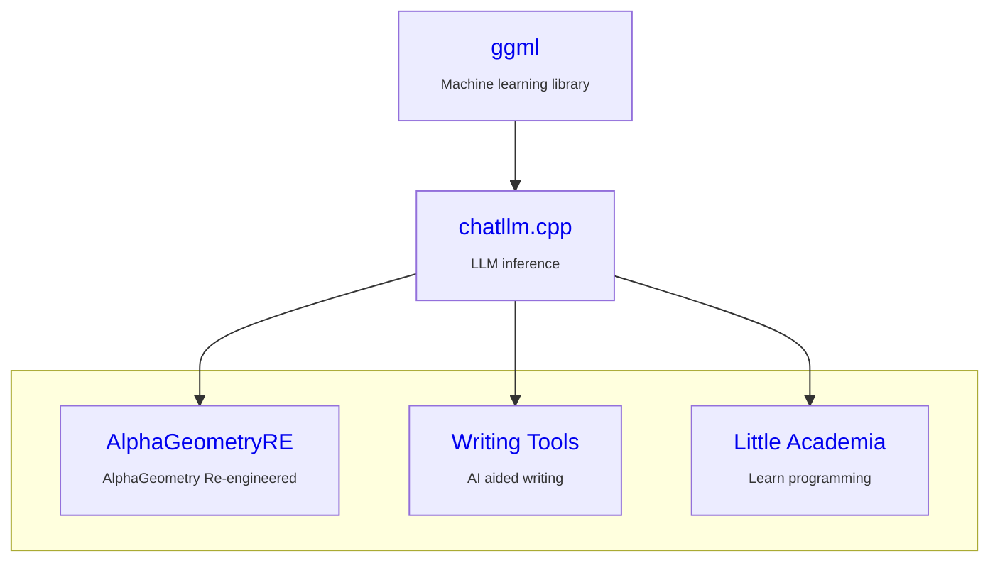

# ChatLLM.cpp

[中文版](README_zh.md)

[](LICENSE) [](https://github.com/foldl/chatllm.cpp/actions/workflows/build.yml)


Inference of a bunch of models from less than 1B to more than 300B, for real-time [multimodal](./docs/multimodal.md) chat with [RAG](./docs/rag.md) on your computer (CPU & GPU),
pure C++ implementation based on [@ggerganov](https://github.com/ggerganov)'s [ggml](https://github.com/ggerganov/ggml).

Deliver accurate or better results than other implementations [o](https://github.com/ggml-org/llama.cpp/issues/15600#issuecomment-3400860774)-[c](https://github.com/ggml-org/llama.cpp/issues/13694#issuecomment-3454877635)-[c](https://github.com/ggml-org/llama.cpp/issues/3377#issuecomment-2198554173)-[a](https://github.com/ggml-org/llama.cpp/issues/8183#issuecomment-2198348578)-[s](https://github.com/ggml-org/llama.cpp/pull/13760#issuecomment-2998476325)-[i](https://github.com/lmstudio-ai/lmstudio-bug-tracker/issues/798#issue-3266514944)-onally.

| [Supported Models](./docs/models.md) | [Download Quantized Models](./docs/quick_start.md#download-quantized-models) |



**What's New:**

* 2025-11-06: Maya1
* 2025-11-03: Ouro
* 2025-10-31: Megrez2-3x7B-A3B
* 2025-10-25: LLaDA2.0-mini
* 2025-10-14: Nanonets-OCR2
* 2025-10-13: dots.ocr
* 2025-10-10: [I can draw](./docs/multimodal.md): Janus-Pro
* 2025-09-23: Qwen2.5-VL
* 2025-09-15: Ling/Ring-mini-2.0
* 2025-09-08: GroveMoE
* 2025-09-03: Apertus
* 2025-08-22: Seed-OSS
* 2025-08-11: GPT-OSS
* 2025-08-05: Pangu-Embedded
* 2025-07-29: Jiutian
* 2025-07-10: SmolLM-3
* 2025-07-05: Pangu-Pro-MoE
* 2025-07-04: ERNIE-MoE
* 2025-06-30: Hunyuan-A13B, ERNIE-Dense
* 2025-06-21: [I can hear](./docs/multimodal.md): Qwen2-Audio
* 2025-06-10: SmolVLM2
* 2025-06-07: MiniCPM4
* 2025-06-06: Qwen-3 Embedding & Reranker
* 2025-06-03: Kimi-VL
* 2025-05-28: Gemma3 fully supported
* 2025-05-23: [I can see](./docs/multimodal.md): Fuyu
* 2025-05-21: Re-quantization when loading (e.g. `--re-quantize q4_k`)
* 2025-05-19: OuteTTS
* 2025-05-17: [I can speak](./docs/multimodal.md): Orpheus-TTS
* 2025-05-11: Seed-Coder
* 2025-04-30: QWen3, MiMo
* 2025-03-24: [GGMM](./docs/ggmm.md) file format
* 2025-02-21: [Distributed inference](./docs/rpc.md)
* 2025-02-10: [GPU acceleration](./docs/gpu.md) 🔥
* 2024-12-09: [Reversed role](./docs/fun.md#reversed-role)
* 2024-11-21: [Continued generation](./docs/fun.md#continued-generation)
* 2024-11-01: [generation steering](./docs/fun.md#generation-steering)
* 2024-06-15: [Tool calling](./docs/tool_calling.md)
* 2024-05-29: [ggml](https://github.com/ggerganov/ggml) is forked instead of submodule
* 2024-05-14: [OpenAI API](./docs/binding.md#openai-compatible-api), CodeGemma Base & Instruct supported
* 2024-05-08: [Layer shuffling](./docs/fun.md#layer-shuffling)

## Features

* [x] Accelerated memory-efficient CPU/GPU inference with int4/int8 quantization, optimized KV cache and parallel computing;
* [x] Use OOP to address the similarities between different _Transformer_ based models;
* [x] Streaming generation with typewriter effect;
* [x] Continuous chatting (content length is virtually unlimited)

    Two methods are available: _Restart_ and _Shift_. See `--extending` options.

* [x] [Retrieval Augmented Generation](./docs/rag.md) (RAG) 🔥

* [x] [LoRA](./docs/models.md#lora-models);
* [x] Python/JavaScript/C/Nim [Bindings](./docs/binding.md), web demo, and more possibilities.

## Quick Start

As simple as `main_nim -i -m :model_id`. [Check it out](./docs/quick_start.md).

## Usage

### Preparation

Clone the ChatLLM.cpp repository into your local machine:

```sh
git clone --recursive https://github.com/foldl/chatllm.cpp.git && cd chatllm.cpp
```

If you forgot the `--recursive` flag when cloning the repository, run the following command in the `chatllm.cpp` folder:

```sh
git submodule update --init --recursive
```

### Quantize Model

**Some quantized models can be downloaded [on demand](./docs/quick_start.md#download-quantized-models).**

Install dependencies of `convert.py`:

```sh
pip install -r requirements.txt
```

Use `convert.py` to transform models into quantized GGML format. For example, to convert the _fp16_ base model to q8_0 (quantized int8) GGML model, run:

```sh
# For models such as ChatLLM2-6B, InternLM, LlaMA, LlaMA-2, Baichuan-2, etc
python convert.py -i path/to/model -t q8_0 -o quantized.bin --name ModelName

# For some models such as CodeLlaMA, model type should be provided by `-a`
# Find `-a ...` option for each model in `docs/models.md`.
python convert.py -i path/to/model -t q8_0 -o quantized.bin -a CodeLlaMA --name ModelName
```

Use `--name` to specify model's name in English. Optionally, use `--native_name` to specify model's name in another language.
Use `-l` to specify the path of the LoRA model to be merged, such as:

```sh
python convert.py -i path/to/model -l path/to/lora/model -o quantized.bin --name ModelName
```

Note: Appropriately, only HF format is supported (with a few exceptions); Format of the generated `.bin` files is different from the one (GGUF) used by `llama.cpp`.

### Build

In order to build this project you have several different options.

- Using `CMake`:

  ```sh
  cmake -B build
  cmake --build build -j --config Release
  ```

  The executable is `./build/bin/main`.

  There are lots of `GGML_...` options to play with. Example: Vulkan acceleration together with RPC and backend dynamic loading:

  ```sh
  cmake -B build -DGGML_VULKAN=1 -DGGML_RPC=1 -DGGML_CPU_ALL_VARIANTS=1 -DGGML_BACKEND_DL=1
  ```

### Run

Now you may chat with a quantized model by running:

```sh
./build/bin/main -m llama2.bin  --seed 100                      # Llama-2-Chat-7B
# Hello! I'm here to help you with any questions or concerns ....
```

To run the model in interactive mode, add the `-i` flag. For example:

```sh
# On Windows
.\build\bin\Release\main -m model.bin -i

# On Linux (or WSL)
rlwrap ./build/bin/main -m model.bin -i
```

In interactive mode, your chat history will serve as the context for the next-round conversation.

Run `./build/bin/main -h` to explore more options!

## Acknowledgements

* This project is started as refactoring of [ChatGLM.cpp](https://github.com/li-plus/chatglm.cpp), without which, this project could not be possible.

* Thank those who have released their the model sources and checkpoints.

* `chat_ui.html` adapted from [Ollama-Chat](https://github.com/Oft3r/Ollama-Chat).

## Note

This project is my hobby project to learn DL & GGML, and under active development. PRs of features won't
be accepted, while PRs for bug fixes are warmly welcome.
