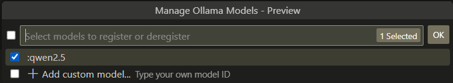

# Bindings

## Precondition

Build target `libchatllm`:

### Windows:

Assume MSVC is used.

1. Build target `libchatllm`:

    ```sh
    cmake --build build --config Release --target libchatllm
    ```

1. Copy `libchatllm.dll`, `libchatllm.lib` and `ggml.dll` to `bindings`;

### Linux/MacOS:

1. Build target `libchatllm`:

    ```sh
    cmake --build build --target libchatllm
    ```

## Python

### Command line

Run [chatllm.py](../bindings/chatllm.py) with exactly the same command line options.

For example,

* Linux: `python3 chatllm.py -i -m path/to/model`

* Windows: `python chatllm.py -i -m path/to/model`

If `OSError: exception: access violation reading 0x0000000000000000` occurred, try:

* Update to latest Python version;
* Install latest [Microsoft Visual C++ Redistributable](https://learn.microsoft.com/en-us/cpp/windows/latest-supported-vc-redist);
* Remove all `msvcp140.*` from your Python directory.

### Web demo

There is also a [Chatbot](../scripts/chatllm_st.py) powered by [Streamlit](https://streamlit.io/):


To start it:

```sh
streamlit run chatllm_st.py -- -i -m path/to/model
```

Note: "STOP" function is not implemented yet.

### OpenAI/Ollama Compatible API

[Here](../scripts/openai_api.py) is a server providing some OpenAI/Ollama Compatible API. Note that most of
the parameters are ignored.

`openai_api.py` supports loading several types models for chatting, code completion (FIM), or text embedding etc.
For example, load to models, one for chatting, one for FIM:

```sh
python openai_api.py ---chat path/to/deepseekcoder-1.3b.bin ---fim /path/to/deepseekcoder-1.3b-base.bin
```

Additional arguments for each model can be specified too. For example:

```sh
python openai_api.py ---chat path/to/chat/model --top_k 2 ---fim /path/to/fim/model --temp 0.8
```

`openai_api.py` uses API path to select chatting or completion models: when API path is ending with
`/generate`, code completion model is selected; when ending with `/completions`
chatting model is selected.

Some base models that can be used for code completion:

* DeepSeekCoder: [Coder-Base-1.3B](https://huggingface.co/deepseek-ai/deepseek-coder-1.3b-base)
* CodeGemma v1.1: [Base-2B](https://huggingface.co/google/codegemma-1.1-2b), [Base-7B](https://huggingface.co/google/codegemma-1.1-7b)
* StarCoder2: [Base-3B](https://huggingface.co/bigcode/starcoder2-7b), [Base-7B](https://huggingface.co/bigcode/starcoder2-7b), [Base-15B](https://huggingface.co/bigcode/starcoder2-15b) (not recommended)

This module provides sufficient Ollama API so that it can be used to emulate Ollama model provider in Visual Studio Code Copilot.
For example, starting the server with a model:

```sh
python openai_api.py ---chat :qwen2.5
```

Select the model from Ollama provider:



## JavaScript/TypeScript

### Command line

Run [chatllm.ts](../bindings/chatllm.ts) with exactly the same command line options using [Bun](https://bun.sh/):

```shell
bun run chatllm.ts -i -m path/to/model
```

WARNING: Bun [looks buggy on Linux](https://github.com/oven-sh/bun/issues/10242).

## Other Languages

`libchatllm` can be utilized by all languages that can call into dynamic libraries.

### C

* Linux

    1. Build `bindings\main.c`:

        ```sh
        export LD_LIBRARY_PATH=.:$LD_LIBRARY_PATH
        gcc main.c libchatllm.so
        ```

    1. Test `a.out` with exactly the same command line options.

* Windows:

    1. Build `bindings\main.c`:

        ```shell
        cl main.c libchatllm.lib
        ```

    1. Test `main.exe` with exactly the same command line options.

### Pascal (Delphi/FPC)

Pascal [binding](../bindings/libchatllm.pas) is also available.

Examples:

* [main.dpr](../bindings/main.dpr), which can be built by Delphi or FPC.
* [Writing Tools](https://github.com/foldl/WritingTools).

### Nim

Examples:

* [main.nim](../bindings/main.nim), which highlights code snippets.

    Build:

    ```
    nim c -d:Release -d:ssl main.nim
    ```

    

### Others

* [V-lang/VB.net/C#](https://github.com/foldl/chatllm.cpp/issues/41)